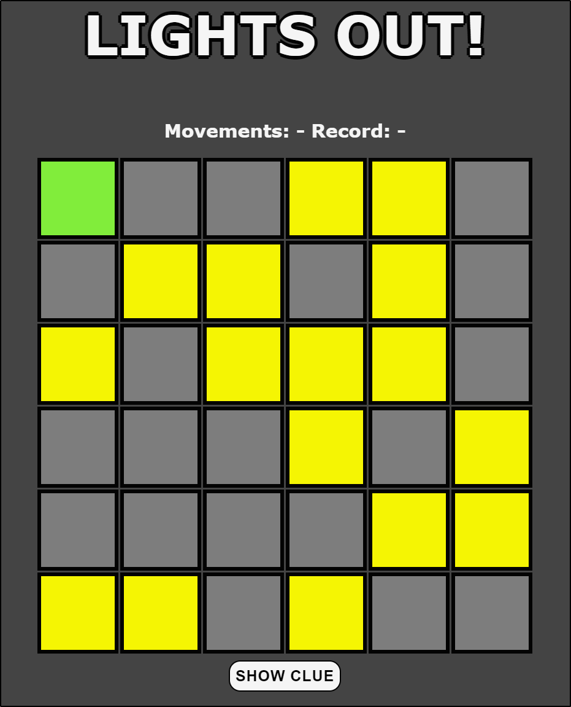

# Lights out!

## How to run
1. Install NodeJS and Yarn.
1. Clone the repository by running `git clone https://github.com/Pierca7/lights-out.git`
1. Run `yarn install` on the root folder to get all dependencies.
1. Run `yarn start`, and navigate to [http:\\localhost:8080](http:\\localhost:8080)

## How to play
The game starts with a random amount off tiles turned on. Pression on a tile will toggle it and the adjacent tiles. 
The goal turn all the tiles off in the fewest movements possible.

The game provides a clues system, which calculates the next tile you need to press in order to solve the puzzle.

**The yellow tiles represent the lights on, the grey tiles the lights off while the green tile is the clue given by the app.**
